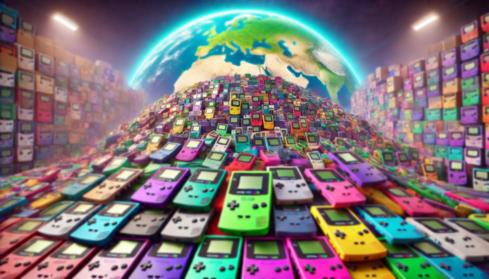

# gbc-census

A census of Game Boy Color 'CGB' devices. This data was manually scraped over a few years.

The data is sorted by serial number and split by prefix into four CSV files:
- `C` series: Made in Japan, distributed in Japan and internationally ([here](gbc-census-C.csv)).
- `CG` series: Made in Japan and China for North America ([here](gbc-census-CG.csv)).
- `CH` series: Made in China, distributed internationally ([here](gbc-census-CH.csv)).
- `X` series: Promotional units ([here](gbc-census-X.csv)).  

I welcome feedback and suggestions, to continue improving the project for everyone. It really motivates me that people enjoy my work. Please keep the data gnomes fed with a [star](https://github.com/ace-dent/gbc-hw/stargazers)! ⭐️

## Acknowledgements

Contributors: @3615Retro, @Matthaios-Bobolis, @ThibautPlg.  
Special thanks to @Gekkio for the Game Boy hardware [database](https://gbhwdb.gekkio.fi).

## Legal

All trademarks referenced in this project remain the sole property of their respective owners.  

This work is licensed under a [Creative Commons Attribution-NonCommercial-ShareAlike 4.0 International License](https://creativecommons.org/licenses/by-nc-sa/4.0/). Under this license, you may share and adapt this work, provided you attribute it properly, share derivatives under the same license, and do not use it for commercial purposes.

The data contained within this project is provided "as is", without warranty of any kind regarding accuracy, completeness, or fitness for any specific purpose. Use of the provided data is entirely at your own risk. Please see the LICENSE for full terms of use.

For inquiries regarding alternative licensing arrangements, commercial use, or other permissions, please contact the project author directly.

**© 2022–2025 Andrew C.E. Dent**.