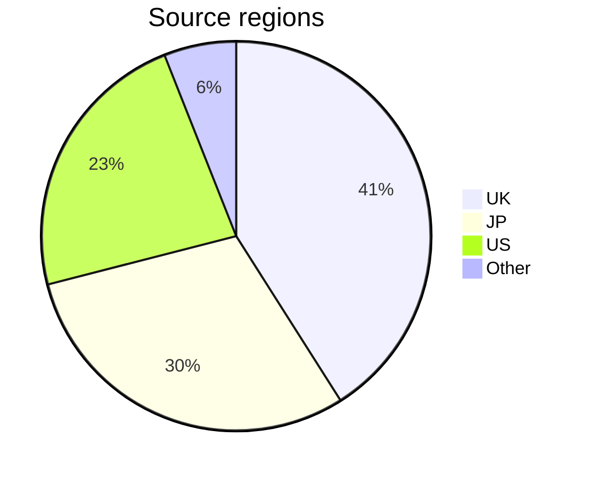

# gbc-census – Notes

## Data collection

The census collects the following information for each device:

- `Date` - The day when data was collected.
- `Serial number` - The unique alphanumeric identifier for each device, labelled on the rear of the unit (e.g. `CH12345678`). It is the _key_ for the census by which data is sorted. 
- `Model` - The model identifier from the larger rear label (e.g. `C/CGB-EUR`). When not clearly visible or absent, marked as 'Missing'. If a replica label is detected, it is marked as 'Reproduction'.
- `PCB #` - PCB revision number with leading zero: `02` to `06`, or `Blank` (for `СGВ-СРU-01` boards). Printed under the lower-left battery terminal. It indicates what CPU stepping may be present in the device.
- `Panel (A-B)` - The two hyphen-separated numbers on the PCB, below the revision (e.g. `1-2`). The silk screened numbers correspond to the individual PCB panel, for traceability of the manufacturing process. Where a digit is not clearly visible, it is marked with `?`.
- `Shell` - The shell design style (details [here](gbc-shells.md)).
- `Source` - Origin of the data. Normally the country code (ISO 3166-1 alpha-2), followed by the website.


## Census sampling

The project aims to collect ~10 thousand results, to sample 0.02% or 1:5000 units of the ~46M population. Adding information to the census takes on average ~3 minutes per device; the completed work represents 500+ hours of labour. The process generally follows 4 steps:
1. **Sourcing** – High quality images are identified and correspondence may be necessary to collect all the required information. The candidate is compared against existing data, to reject duplicates or devices that are clearly modified, or where provenance is questionable. 
2. **Capture** – Data is extracted manually and with OCR, hand checked and entered into a Google Form which performs further validation. 
3. **Accession** – Newly captured data is carefully reviewed for consistency, in context with the existing results, before being integrated into the main data set.
4. **Publishing** – The census is checked a final time, tweaked if necessary, then separate CSV files are generated and uploaded publicly.

Much of the effort and time is spent ensuring the accuracy of the data set. It may take several years to complete the project.

Progress towards ~0.02% sampling of each serial range:

```text
C   - 52% [##########----------] 1238 / 2400
CG1 - 17% [###-----------------]  271 / 1600
CG5 - 18% [####----------------]  433 / 2400
CH  - 40% [########------------] 1211 / 3000

All - 33% [#######-------------] 3265 / 10k
```


## Limitations

Data collection has been biased towards the author's own region, so may not reflect the global population. However, the UK market should be indicative of the wider European region. While more international data will be added, this bias may still persist. It is difficult to source devices for North America, in part because the larger serial labels (with barcode) are often missing or damaged.



<hr>


## Release history

```text
29-May-2024, R00759  
12-Jun-2024, R00800  
01-Jul-2024, R00861  
09-Jul-2024, R00916  
29-Jul-2024, R01111  
06-Aug-2024, R01264
19-Aug-2024, R01565
30-Aug-2024, R01757
10-Sep-2024, R02042
31-Oct-2024, R02245
20-Nov-2024, R02525
04-Jan-2025, R03009
17-Jan-2025, R03158
19-May-2025, R03265
XX-Jun-2025, R0XXXX
```

