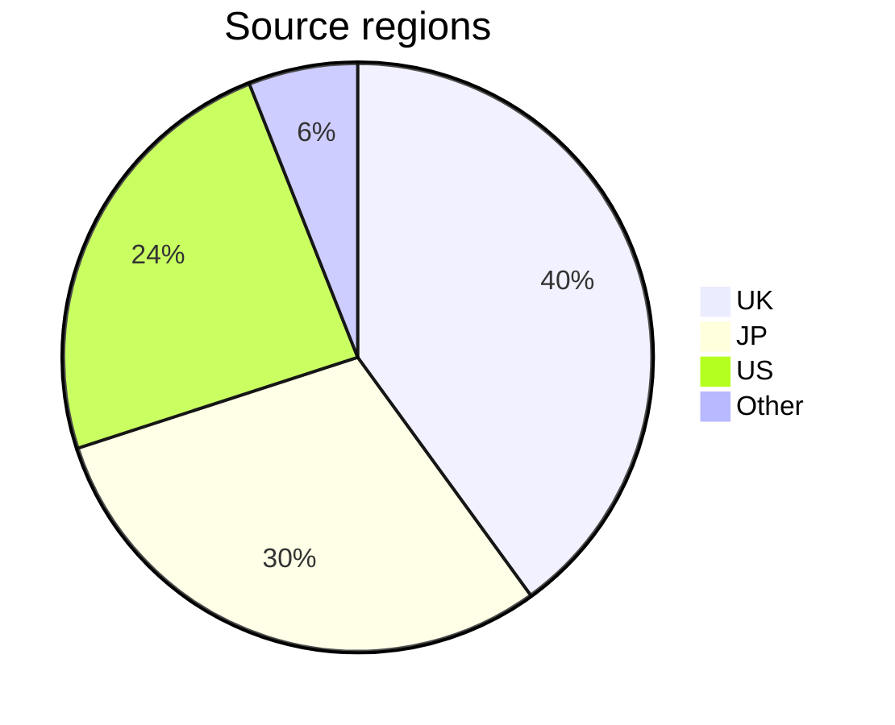

# gbc-census – Notes

## Data

The census collects the following information for each device:

- **Date** – When the unit was first observed and data collected.
- **Serial number** – The unique alphanumeric identifier for each device, labelled on the rear of the unit (e.g. `CH12345678`). It is the _key_ for the census by which data is sorted. 
- **Model** – The model shown on the larger rear label (e.g. `C/CGB-EUR`). When not clearly visible or absent, marked as 'Missing'. If a replica label is detected, it is marked as 'Reproduction'.
- **PCB #** – PCB revision number with leading zero: `02` to `06`, or `Blank` (for `СGВ-СРU-01` boards). Printed under the lower-left battery terminal. It indicates what CPU stepping may be present in the device.
- **Panel (A-B)** – The two hyphen-separated numbers on the PCB, below the revision (e.g. `1-2`). These silk-screened numbers identify the individual PCB panel, used for traceability during manufacturing. If a digit is unclear, it is marked with `?`. The occasional printing errors observed, are replicated with double-struck digits `𝟘–𝟡`.
- **Shell** – The design style of the shell (details [here](gbc-shells.md)).
- **Source** – Origin of the data. Normally the country code (ISO 3166-1 alpha-2), followed by the website.


## Sampling

The project aims to collect ~10,000 results, to sample 0.02% — or 1 in 5,000 — of the estimated 46 million units produced. Adding a single entry to the census takes, on average, 3+ minutes per device. The final census will represent more than 500 hours of labour. 

The process generally follows four steps:

1. **Sourcing** – High quality images are identified and correspondence may be necessary to collect all the required information. Each candidate is compared against existing data to reject duplicates, clearly modified devices, or those with questionable provenance.
2. **Capture** – Data is extracted manually and with OCR, hand checked and entered into a Google Form which performs further validation. 
3. **Accession** – Newly captured data is carefully reviewed for consistency within the context of existing results, before being integrated into the main data set.
4. **Publishing** – The census is checked a final time, tweaked if necessary, then separate CSV files are generated and uploaded publicly.

Much of the time and effort is devoted to ensuring the accuracy of the data set. It may take several years to complete the project.

Progress towards ~0.02% sampling for each serial range:

```text
C   — 54% ▕█████████████▌           ▏ 1303 / 2400
CG1 — 18% ▕████▌                    ▏  289 / 1600
CG5 — 19% ▕████▊                    ▏  460 / 2400
CH  — 41% ▕██████████▎              ▏ 1237 / 3000

All — 34% ▕████████▌                ▏ 3410 / 10k
```


## Limitations

Data collection has been biased toward the author's own region, and may not fully reflect the global population. However, the UK market is likely indicative of the broader European region. While more international data will be added over time, some degree of regional bias may persist. Devices from North America are especially difficult to source, in part because the larger serial labels (with barcodes) are often missing or damaged.



<hr>


## History

Releases are tracked by a revision number `R01234` – a cumulative row count, reflecting the size of the dataset. 

```text
29-May-2024, R00759  
12-Jun-2024, R00800  
01-Jul-2024, R00861  
09-Jul-2024, R00916  
29-Jul-2024, R01111  
06-Aug-2024, R01264
19-Aug-2024, R01565
30-Aug-2024, R01757
10-Sep-2024, R02042
31-Oct-2024, R02245
20-Nov-2024, R02525
04-Jan-2025, R03009
17-Jan-2025, R03158
19-May-2025, R03265
31-May-2025, R03410
```

