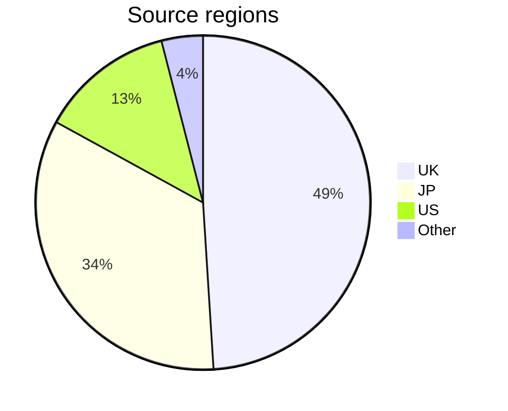

# gbc-census – notes

## Data collection

The census collects the following information for each device:

- `Date` - The day that data was collected.
- `Serial number` - The serial number is the unique alphanumeric identifier for each device, labelled on the rear of the unit (e.g. `CH12345678`). It is the _key_ for the census by which data is sorted. 
- `Model` - The model identifier from the larger rear label (e.g. `C/CGB-EUR`). When not clearly visible, marked as 'Missing'.
- `PCB #` - PCB revision number with leading zero: `02` to `06`, or `Blank`. Printed under the lower-left battery terminal. It indicates what CPU stepping may be present in the device.
- `Panel (A-B)` - The two, hyphen-separated numbers on the PCB below the revision (e.g. `1-2`). Where a number is not clearly visible, it is marked with `?`.
- `Shell` - The shell [design](gbc-shells.md) style.
- `Source` - Origin of the data. Normally the country code (ISO 3166-1 alpha-2), followed by the website.


## Census sampling

The project aims to collect ~10 thousand results, to sample 0.02% or 1:5000 units of the ~45.8M population. Adding information to the census takes on average ~3 minutes per device; the completed work represents 500+ hours of labour. The process generally follows 4 steps:
1. **Sourcing** – High quality images are identified and correspondence may be necessary to collect all the required information. Care is taken to reject duplicates, devices that are clearly modified or where provenance is questionable.
2. **Capture** – Data is extracted manually and with OCR, hand checked and entered into a Google Form which performs further validation. 
3. **Accession** – Newly captured data is carefully reviewed for consistency, in context with the existing results, before being integrated into the main data set.
4. **Publishing** – The census is checked a final time, tweaked if necessary, then separate CSV files are generated and uploaded publicly.

Much of the effort and time is spent ensuring the accuracy of the data set. It may take several years to complete the project.

Progress towards ~0.02% sampling for each serial range:

```text
C   - 35% [#######-------------]  850 / 2400
CG1 -  8% [##------------------]  122 / 1600
CG5 -  6% [#-------------------]  149 / 2400
CH  - 29% [######--------------]  865 / 3000

All - 20% [####----------------] 2042 / 10k
```


## Limitations

Data sampling has been biased towards the author's own region, so may not reflect the global population. However, the UK market should be indicative of the wider European region. While more international data will be added, this bias may still persist. 



<hr>

## Release history

```text
29-May-2024, R0759  
12-Jun-2024, R0800  
01-Jul-2024, R0861  
09-Jul-2024, R0916  
29-Jul-2024, R1111  
06-Aug-2024, R1264
19-Aug-2024, R1565
30-Aug-2024, R1757
10-Sep-2024, R2042
```