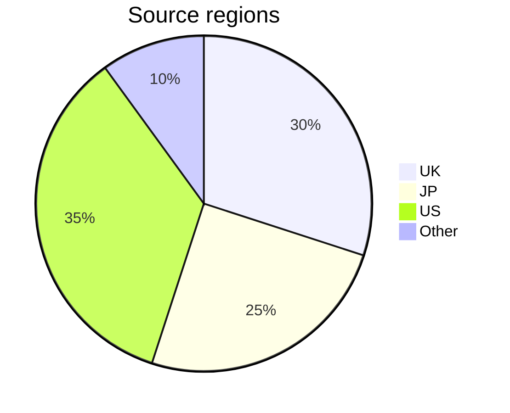

# gbc-census – Notes

## Data

The census collects the following information for each device:

- **Serial number** – The unique alphanumeric identifier for each device, labelled on the rear of the unit (e.g. `CH12345678`). It is the _key_ for the census by which data is sorted. 
- **Production** – The production code on the larger rear label (e.g. `C/CGB-EUR`). This can provide information on _where_ the device was produced (e.g. `C/` for China), _when_ (e.g. `-2`), or indicates a _special edition_ (e.g. `-POB`). Marked as 'Missing' when it is not clearly visible or absent. Reproduction labels are marked as a 'Replica', when detected.
- **PCB #** – PCB revision number with leading zero: `02` to `06`, or `Blank` (for `СGВ-СРU-01` boards). Printed under the lower-left battery terminal. It indicates what CPU stepping may be present in the device.
- **Panel (A-B)** – The two hyphen-separated numbers on the PCB, below the revision (e.g. `1-2`). These silk-screened numbers identify the individual PCB panel, used for traceability during manufacturing. If a digit is unclear, it is marked with `?`. The occasional printing errors observed, are replicated with double-struck digits `𝟙`, `𝟚`, etc. (Unicode characters U+1D7D8–E1).
- **Shell** – The design style of the shell (details [here](gbc-shells.md)).
- **Source** – Origin of the data. Normally the country code (ISO 3166-1 alpha-2), followed by the website.
- **Date** – When the unit was first observed and data collected, in ISO 8601 format: `YYYY-MM-DD`.


## Sampling

The project aims to collect ~10,000 results, to sample 0.02% — or 1 in 5,000 — of the estimated 46 million units produced. Adding a single entry to the census takes, on average, 3+ minutes per device. The final census will represent more than 500 hours of labour. 

The process generally follows four steps:

1. **Sourcing** – High quality images are identified and correspondence may be necessary to collect all the required information. Each candidate is compared against existing data to reject duplicates, clearly modified devices, or those with questionable provenance.
2. **Capture** – Data is extracted manually and with OCR, hand checked and entered into a Google Form which performs further validation. 
3. **Accession** – Newly captured data is carefully reviewed for consistency within the context of existing results, before being integrated into the main data set.
4. **Publishing** – The census is checked a final time, tweaked if necessary, then separate CSV files are generated and uploaded publicly.

Much of the time and effort is devoted to ensuring the accuracy of the data set. It may take several years to complete the project.

### Progress

Sampling progress toward the census target, shown by serial range:

```text
C   —  64% ▕████████████████         ▏  1537 / 2400
CG1 —  36% ▕█████████                ▏   583 / 1600
CG5 —  37% ▕█████████▎               ▏   904 / 2400
CH  —  47% ▕███████████▊             ▏  1428 / 3000

All —  46% ▕███████████▌             ▏  4617 / 10k
```


## Limitations

While international coverage continues to expand, some regional bias may persist. Despite North America having the highest sales volume, devices from this region are harder to source, as the larger serial labels (with barcodes) are often missing or damaged.



<hr>


## History

Releases are identified by a revision number (e.g. `R01234`), which corresponds to the cumulative row count and reflects the dataset size. Milestone releases are archived with [Zenodo](https://doi.org/10.5281/zenodo.17886467).

```text
2026-01-05, R04617
2025-12-14, R04318
2025-12-02, R04092
2025-11-03, R03678
2025-09-05, R03572
2025-06-06, R03516
2025-05-31, R03410
2025-05-19, R03265
2025-01-17, R03158
2025-01-04, R03009
2024-11-20, R02525
2024-10-31, R02245
2024-09-10, R02042
2024-08-30, R01757
2024-08-19, R01565
2024-08-06, R01264
2024-07-29, R01111
2024-07-09, R00916
2024-07-01, R00861
2024-06-12, R00800
2024-05-29, R00759
```

